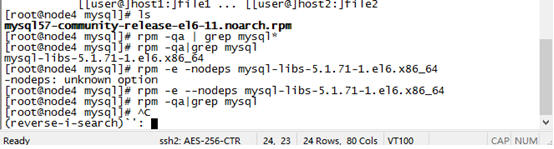
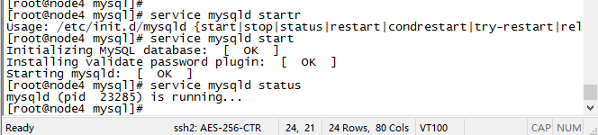
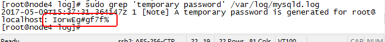
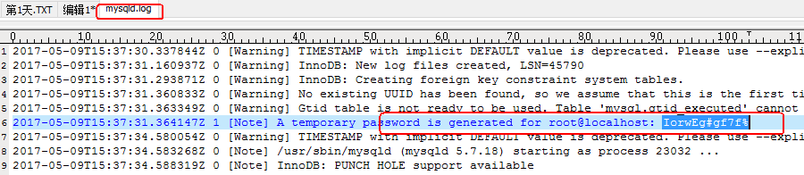
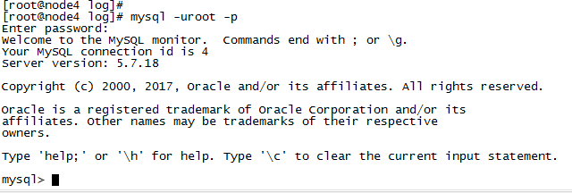
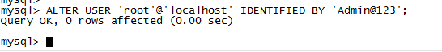
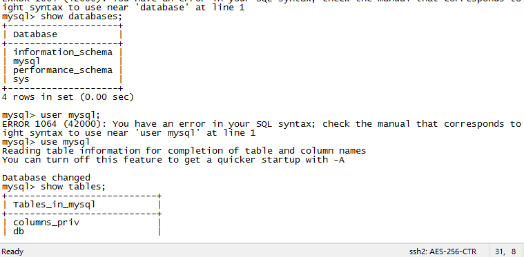

## 1 Check vm.swappiness on all your nodes 
 * 1 sysctl vm.swappiness  
 * 2 sudo sysctl vm.swappiness=10 
 * 3 vi /etc/sysctl.conf
   * add vm.swappiness = 1
 * 4 sysctl -p   

## MySQL installation - Plan Two Detail

* 1.准备文件
  
  将文件拷贝到服务器
 
   [root@node5 softwares]# scp mysql57-community-release-el6-11.noarch.rpm node4:/softwares/mysql
 
 * 2.删除系统自带Mysql
 
   [root@node4 mysql]# rpm -qa|grep mysql
  
   mysql-libs-5.1.71-1.el6.x86_64
  
   [root@node4 mysql]# rpm -e -nodeps mysql-libs-5.1.71-1.el6.x86_64
  
   -nodeps: unknown option
  
   [root@node4 mysql]# rpm -e --nodeps mysql-libs-5.1.71-1.el6.x86_64
  
   [root@node4 mysql]# rpm -qa|grep mysql
  
  

  
* 3.安装Mysql

  $ rpm -ivh mysql57-community-release-el6-11.noarch.rpm
 
  $ yum update
 
  $ yum install mysql-server
 
* 4.启动Mysql

  $ service mysqld start

  $ service mysqld status

 
  

 
* 5.设置管理密码

  $ sudo grep 'temporary password' /var/log/mysqld.log
 
  
  

  
  
  

  
   输入上述密码
  
  
  

  
   修改密码：

  mysql>  ALTER USER 'root'@'localhost' IDENTIFIED BY 'Admin@123';

  
  

* 6.选择数据库

   mysql>use mysql;
   
   mysql>show tables;
   
  
  

 
